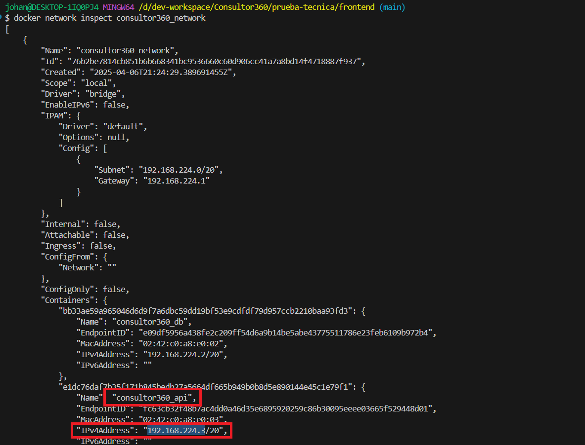
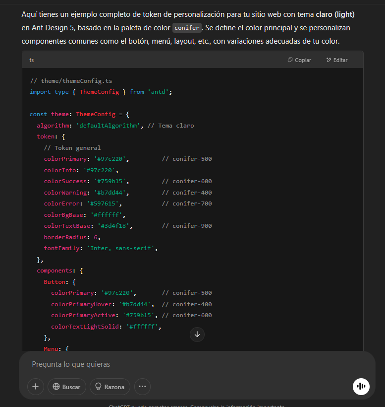
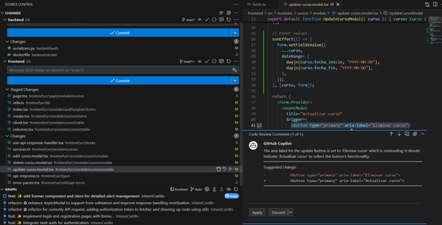

- [Instrucciones para instalar y ejecutar el proyecto frontend](#instrucciones-para-instalar-y-ejecutar-el-proyecto-frontend)
  - [Requerimientos](#requerimientos)
  - [Variables de entorno](#variables-de-entorno)
  - [Instalación y ejecución](#instalación-y-ejecución)
- [Tecnologías y herramientas utilizadas](#tecnologías-y-herramientas-utilizadas)
- [Codificación con IA](#codificación-con-ia)


El proyecto desplegado en Vercel se encuentra disponible en [https://consultor360-frontend.vercel.app/](https://consultor360-frontend.vercel.app/cursos)

> Nota: Si el fetching de cursos falla, se debe a que el backend en `Render` se encuentra detenido temporalmente por **inactividad**, debe esperar menos de 1 o 2 minutos recargando la página hasta que el mensaje de error desaparezca.  

# Instrucciones para instalar y ejecutar el proyecto frontend

## Requerimientos

- Proyecto backend ejecutándose en [http://localhost:8000](http://localhost:8000)
  
- Docker y Docker Compose

## Variables de entorno
1. Copiar el archivo `.env.example` a `.env`.

2. Generar una clave secreta para la variable `NEXTAUTH_SECRET` en [https://generate-secret.vercel.app/32](https://generate-secret.vercel.app/32).


3. Para la variable `[ip-backend]`, en la carpeta del proyecto backend ejecutándose,  ejecutar el siguiente comando.

```bash
docker network inspect consultor360_network
```
Debe buscar el contenedor de nombre `consultor360_api` y copiar la IP de la clave `IPv4Address`, como se muestra en la siguiente imagen.



1. Reemplazar los valores de las variables de entorno en el archivo `.env`, incluyendo `[ip-backend]`.

Ejemplo:

```dotenv
ENVIRONMENT=development
NEXTAUTH_SECRET= # llave secreta generada en el paso 2
NEXTAUTH_URL=http://localhost:3000
API_URI=http://[ip-backend]:8000/api/v1 # Ej: http://192.168.224.3:8000/api/v1
```


## Instalación y ejecución

1. Abrir una terminal en la carpeta raíz del proyecto frontend.
2. Ejecutar el siguiente comando para instalar las dependencias y ejecutar el proyecto:

```bash
docker compose up -d
```

 Una vez finalizada la ejecución, el servicio se encontrará disponible en [http://localhost:3000](http://localhost:3000).

# Tecnologías y herramientas utilizadas
- [Next.js 14](https://nextjs.org/)
- [Ant Design](https://ant.design/)
- [Tailwind CSS](https://tailwindcss.com/)
- [Zustand](https://zustand.docs.pmnd.rs/getting-started/introduction)
- [Tanstack Query](https://tanstack.com/query/docs)
- [Next Auth](https://next-auth.js.org/)
- [Zod](https://zod.dev/) 
- [Vercel](https://vercel.com/) (Despliegue)

# Codificación con IA 
Se utilizó IA para agilizar partes del desarrollo del proyecto frontend. Utilizando `Github Copilot` y `ChatGPT`. Algunas de las principales utilidades que se aprovecharon:

- Generación automática de los [temas de la aplicación](./src/constants/theme.ts) usando colores base obtenidos de la paleta de colores de [UI Colors](https://uicolors.app/generate/d3c5c0), agilizando la personalización.

Prompt:
```text
Utilizando la siguiente paleta de colores, genera un token de personalización para mi sitio web basado en Ant Design. El esquema de color debe ser light y debe incluir personalizaciones tanto para los colores principales como para los componentes más comunes, tales como botones, menú, layout, entre otros.

'conifer': {
    '50': '#f9fde8',
    '100': '#f1f9ce',
    '200': '#e2f4a2',
    '300': '#ccea6c',
    '400': '#b7dd44',
    '500': '#97c220',
    '600': '#759b15',
    '700': '#597615',
    '800': '#475e16',
    '900': '#3d4f18',
    '950': '#1f2c07',
},
```

Ejemplo de resultado


- Revisión del código antes de actualizar el repositorio local o remoto



Otras utilidades que se aprovecharon de la IA para el desarrolo:
- Autocompletado de código
- Apoyo en solución de errores